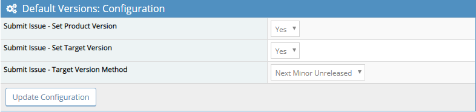

# DefaultVersions MantisBT Plugin

- [DefaultVersions MantisBT Plugin](#DefaultVersions-MantisBT-Plugin)
  - [Description](#Description)
  - [Installation](#Installation)
  - [Usage](#Usage)
    - [Setting the Product Version](#Setting-the-Product-Version)
    - [Setting the Target Version](#Setting-the-Target-Version)

## Description

This plugin allows for automatic setting of the "product version" and "target version" when a bug is submitted.

## Installation

Extract the release archive to the MantisBT installations plugins folder:

    cd /var/www/mantisbt/plugins
    wget -O DefaultVersions.zip https://github.com/mantisbt-plugins/Releases/releases/download/v1.0.0/DefaultVersions.zip
    unzip DefaultVersions.zip
    rm -f DefaultVersions.zip

Ensure to use the latest released version number in the download url:  (version badge available via the [ApiExtend Plugin](https://github.com/mantisbt-plugins/ApiExtend))

Install the plugin using the default installation procedure for a MantisBT plugin in `Manage -> Plugins`.

## Usage

Usage is simple for the most part, simply edit the plugin settings for behavior to match your desired functionality.

### Setting the Product Version

Upon submitting a new bug/issue, the "product version" can be auto-pupulated (if not populated manually when filling out the ticket) with the latest released version.

> Note that the version must exist in your projects versions list.

For example, consider the following project version set:

|Version|Released State|Release Date|
|-|-|-|
|1.2.0|Released|Set|
|1.2.x|Released|Not Set|
|1.2.1|Released|Set|
|1.2.2|Not Released|Set|
|1.3.0|Not Released|Set|
|1.4.0|Not Released|Set|

The version number used to set "product version" in this case will be 1.2.1.

### Setting the Target Version

Upon submitting a new bug/issue, the "target version" can be auto-pupulated (if not populated manually when filling out the ticket) using one of two types of behavior:

1. Next Minor Unreleased - The "target version" will be populated with the next unreleased minor version.
2. Next Unreleased - The "target version" will be populated with the next unreleased patch version.

> Note that the version must exist in your projects versions list.

As an example of the "Next Unreleased" method, consider the following project version set:

|Version|Released State|Release Date|
|-|-|-|
|1.2.0|Released|Set|
|1.2.x|Released|Not Set|
|1.2.1|Released|Set|
|1.2.2|Not Released|Set|
|1.3.0|Not Released|Set|
|1.4.0|Not Released|Set|

The version number used to set "target version" in this case will be 1.2.2.

As an example of the "Next Minor Unreleased" method, consider the following project version set:

|Version|Released State|Release Date|
|-|-|-|
|1.2.0|Released|Set|
|1.2.1|Released|Set|
|1.2.2|Not Released|Set|
|1.3.0|Not Released|Set|
|1.4.0|Not Released|Set|

The version number used to set "target version" in this case will be 1.3.0.
